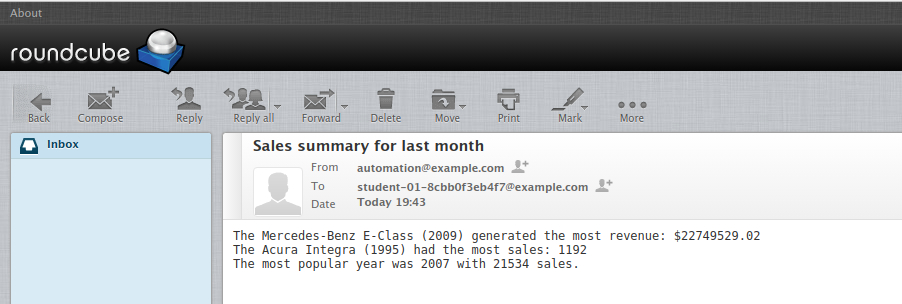

# Automatically Generate a PDF and send it by Email

PDF Generator and send it by Email.

Features:
1. JSON Parser
2. Email sender
3. PDF Generator

## Get Started
1. Clone this repository
2. Before running [`cars.py`](cars.py), choose your `destination_dir` in `main` function. Default is `For Windows`. 
3. Change `sender` and `repicient` in `main` function. Because this repository is for Qwiklabs, you can configure your way of sending email in [`emails.py`](emails.py)
4. Done.

## Files Explanation

### [`car_sales.json`](car_sales.json)
This JSON file contains the car sales data. Sample data:
```markdown
{
    "id": 1,
    "car": {
        "car_make": "Ford",
        "car_model": "Club Wagon",
        "car_year": 1997
    },
    "price": "$5179.39",
    "total_sales": 446
}
```

### [`cars.py`](cars.py)
This file will convert [car_sales.json](car_sales.json) to make report in PDF file. After generating the PDF file, it will be sent on email.

### [`emails.py`](emails.py)
This file will generate the message body and send it to recipient email

#### Preview E-mail's body


### [`reports.py`](reports.py)
This file will generate the reports from JSON file.

#### Preview report's output

